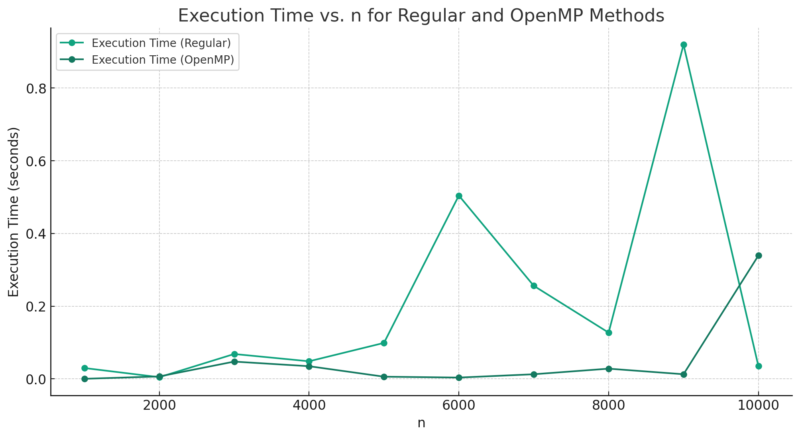
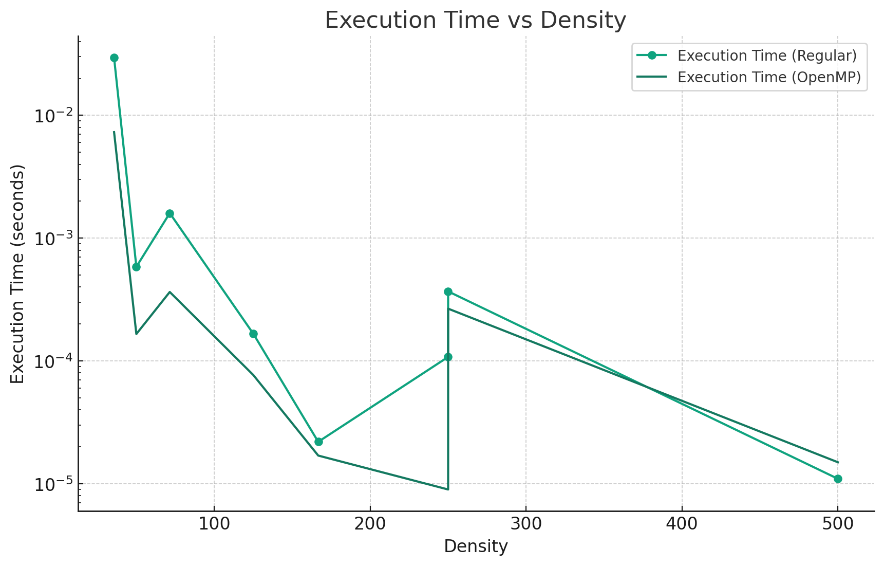

<h1 align="center">TP HCP - Subset sum problem</h1>
<h2 align="center">Algorithme: Hill Climbing</h2>
<h4 align="center">Mael KERICHARD</h4>

   
   
   

# L'algorithme

Le fonctionnement de base du Hill Climbing est relativement simple : à partir d'un point initial dans l'espace de
recherche, l'algorithme explore les voisins de ce point et se déplace vers le voisin ayant la meilleure valeur de la
fonction objectif (par exemple, le voisin le plus haut dans un problème de maximisation). Ce processus est répété
jusqu'à ce qu'aucun voisin n'offre d'amélioration, ce qui signifie que l'algorithme a atteint un sommet local.

Cependant, Hill Climbing peut facilement se retrouver piégé dans un optimum local, surtout si l'espace de recherche est
complexe avec de nombreux sommets locaux. Pour surmonter ce problème, l'algorithme de Hill Climbing avec redémarrage
aléatoire introduit une étape de « redémarrage ». Lorsque l'algorithme atteint un sommet local, au lieu de s'arrêter, il
redémarre à partir d'un point aléatoire dans l'espace de recherche. Ce processus de redémarrage est répété plusieurs
fois. L'idée est qu'en explorant l'espace de recherche à partir de différents points de départ, l'algorithme a une
meilleure chance de trouver un sommet global ou du moins un sommet local plus optimal que celui trouvé lors des
tentatives précédentes.

# Comparaison entre la version classique et la version parallélisée

Pour plusieurs valeurs de `n`, on exécute les deux versions de l'algorithme.

  
🤔 Détail des données générées par le programme

| n     | Density     | Execution Time (Regular) | Solution Found (Regular) | Execution Time (OpenMP) | Solution Found (OpenMP) |
|-------|-------------|--------------------------|--------------------------|-------------------------|-------------------------|
| 1000  | 142.857143  | 0.029849 seconds         | Yes                      | 0.000230 seconds        | Yes                     |
| 2000  | 285.714286  | 0.004638 seconds         | Yes                      | 0.006701 seconds        | Yes                     |
| 3000  | 428.571429  | 0.068413 seconds         | Yes                      | 0.047541 seconds        | Yes                     |
| 4000  | 571.428571  | 0.048394 seconds         | Yes                      | 0.034839 seconds        | Yes                     |
| 5000  | 714.285714  | 0.098957 seconds         | Yes                      | 0.006045 seconds        | Yes                     |
| 6000  | 857.142857  | 0.504400 seconds         | Yes                      | 0.003605 seconds        | Yes                     |
| 7000  | 1000.000000 | 0.256121 seconds         | Yes                      | 0.012735 seconds        | Yes                     |
| 8000  | 1142.857143 | 0.127218 seconds         | Yes                      | 0.028095 seconds        | Yes                     |
| 9000  | 1285.714286 | 0.919623 seconds         | Yes                      | 0.012758 seconds        | Yes                     |
| 10000 | 1428.571429 | 0.034950 seconds         | Yes                      | 0.339343 seconds        | Yes                     |

En utilisant les données fournies, la comparaison révèle des insights quantitatifs significatifs. Par
exemple, pour `n = 1000`, le temps d'exécution avec la méthode régulière est de `0.029849` secondes, alors qu'avec
OpenMP, il est réduit à seulement 0.000230 secondes, montrant une amélioration remarquable de plus de 99%. Cette
tendance se maintient avec des valeurs de `n` plus élevées; par exemple, à `n = 6000`, le temps d'exécution
régulier est de `0.504400` secondes contre `0.003605` secondes avec OpenMP, indiquant à nouveau une efficacité accrue
avec
OpenMP.

Cependant, il est intéressant de noter que cette tendance n'est pas constante pour toutes les valeurs de `n`.
À `n = 10000`, le temps d'exécution régulier est de `0.034950` secondes, tandis que pour OpenMP, il augmente
à `0.339343`
secondes. Cette observation suggère que, bien que OpenMP soit généralement plus efficace, il peut y avoir des cas
spécifiques où la méthode régulière peut surpasser le parallélisme, possiblement en raison de la surcharge liée à la
gestion des threads dans OpenMP.

Ces chiffres illustrent clairement que, bien que l'approche OpenMP offre des avantages significatifs en termes de temps
d'exécution dans la plupart des cas, l'efficacité de chaque méthode peut varier en fonction de la taille spécifique du
problème et de la complexité de l'ensemble de données traité.

## Comparaison en fixant n=500 et en variant la densité

Ce graphique illustre une comparaison intéressante entre les temps d'exécution pour deux méthodes de traitement, Regular et OpenMP, en fonction de la densité. On observe que, globalement, la méthode OpenMP montre des temps d'exécution plus courts que la méthode Regular, ce qui suggère une meilleure efficacité. Cette tendance est particulièrement évidente aux densités plus élevées. Il est important de noter que les différences de performance sont plus marquées à des densités plus faibles. Cela indique que l'optimisation apportée par OpenMP est plus efficace lorsque le système gère des tâches de moindre densité.